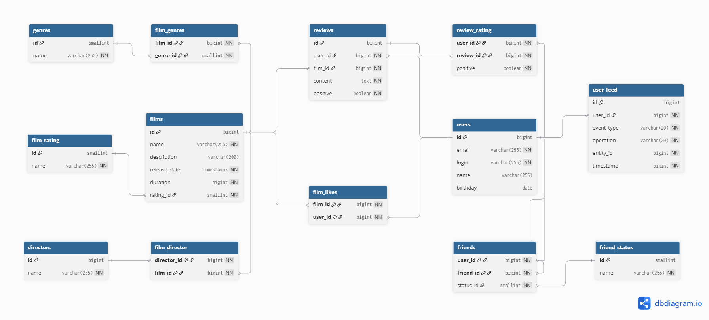

# java-filmorate

## ER-диаграмма:



# Добавленный функционал

## 1. Общие фильмы друзей

**Описание задачи:** реализован вывод общих с другом фильмов с сортировкой по их популярности.  
**API**: ``` GET /films/common?userId={userId}&friendId={friendId}```  

**Описание**: возвращает список фильмов, отсортированных по популярности, которые являются общими для двух пользователей.  

**Параметры:**
* **userId (int)** - идентификатор пользователя, запрашивающего информацию.
* **friendId (int)** - идентификатор пользователя, с которым необходимо сравнить список фильмов.

## 2. Топ-N популярных фильмов

**Описание задачи:** реализован вывод топ-N фильмов по количеству лайков с возможностью фильтрации по жанру и году выпуска.  
**API**: ``` GET /films/popular?count={limit}&genreId={genreId}&year={year} ```  

**Описание**: возвращает список самых популярных фильмов (отсортированных по количеству лайков) указанного жанра за указанный год.  

Параметры:
* **count (int, необязательный)** - максимальное количество возвращаемых фильмов (по умолчанию 10).
* **genreId (int, необязательный)** - идентификатор жанра для фильтрации.
* **year (int, необязательный)** - год выпуска для фильтрации.


## 3. Поиск фильмов

**Описание задачи:** реализован поиск по названию фильмов и по режиссёру (при наличии соответствующей информации). Поиск осуществляется по подстроке.    
**API**: ``` GET /films/search```  

**Параметры строки запроса:**  
* ``` query (string)``` - текст для поиска. 
* ``` by  (string)``` - область поиска. Может принимать значения:
- **director** - поиск по режиссёру.
- **title** - поиск по названию.
- **director,title (или title,director)** - одновременный поиск по режиссёру и названию.  

**Пример запроса:**  
``` GET /films/search?query=крад&by=director,title ```

## 4. Удаление контента

**Описание задачи:** добавлена функциональность для удаления фильма и пользователя по идентификатору.  

### Удаление пользователя ###
**API**:
``` DELETE /users/{userId}```  
**Описание**: удаляет пользователя по его идентификатору.

**Параметры:**  
* **userId (int)** - идентификатор пользователя для удаления.

### Удаление фильма ###
**API**:
``` DELETE /films/{filmId}```  
**Описание**: удаляет фильм по его идентификатору..

**Параметры:**
* **filmId (int)** - идентификатор фильма для удаления.

## 5. Рекомендательная система

**Описание задачи:** реализована простая рекомендательная система для фильмов на основе коллаборативной фильтрации.  

**Алгоритм:**  
1. Найти пользователей с максимальным количеством пересечения по лайкам.
2. Определить фильмы, которые лайкнул "похожий" пользователь, но не лайкнул текущий пользователь.
3. Рекомендовать эти фильмы.  

**API**:
``` GET /users/{id}/recommendations```  

**Описание**: возвращает список рекомендованных фильмов для просмотра пользователю.

**Параметры:**
* **id (int)** - идентификатор пользователя, для которого генерируются рекомендации.
## 6. Лента событий

**Описание задачи:** добавлена возможность просмотра последних событий на платформе: добавление/удаление друзей, добавление/удаление лайков к фильмам, добавление/удаление/обновление отзывов.  
**API**: ``` GET /users/{id}/feed ```  
**Описание**: возвращает ленту событий пользователя.  

**Параметры:**  
* **id (int)** - идентификатор пользователя, для которого запрашивается лента событий.

## 7. Отзывы к фильмам

**Описание задачи:** реализованы отзывы на фильмы с системой оценки полезности (лайк/дизлайк) и рейтингом.  
**Характеристики отзыва:**   
* **Оценка**: полезно/бесполезно.
* **Тип отзыва**: негативный/положительный (определяется автоматически или пользователем).
* **Рейтинг**: Изначально равен 0. Увеличивается на 1 за "лайк" (полезно) и уменьшается на 1 за "дизлайк" (бесполезно). Отзывы сортируются по рейтингу полезности.  

**CRUD операции для отзывов:**  
``` POST /reviews ``` - добавление нового отзыва.  
``` PUT /reviews ``` - редактирование существующего отзыва.  
``` DELETE /reviews/{id} ```  - удаление отзыва по ID.  
``` GET /reviews/{id} ``` - получение отзыва по ID.  

**Получение списка отзывов**:  
``` GET /reviews?filmId={filmId}&count={count} ```  
**Описание**: Получает список отзывов.
* Если **filmId** указан, возвращаются отзывы для конкретного фильма.
* Если **filmId** не указан, возвращаются все отзывы.
* Если **count** не указан, по умолчанию возвращается 10 отзывов.  

**Оценка отзывов**  
``` PUT /reviews/{id}/like/{userId} ``` - пользователь ставит лайк отзыву.  
``` PUT /reviews/{id}/dislike/{userId} ``` - пользователь ставит дизлайк отзыву.  
``` DELETE /reviews/{id}/like/{userId}``` - пользователь удаляет лайк отзыву.  
``` DELETE /reviews/{id}/dislike/{userId}``` - пользователь удаляет дизлайк отзыву.  

## 8. Управление фильмами и режиссёрами

**Описание задачи:** добавлено имя режиссёра в информацию о фильмах, что позволяет реализовать расширенную функциональность для работы с режиссёрами и их фильмографией.  

**Получение списка фильмов режиссёра**  
**API:**  ``` GET /films/director/{directorId}?sortBy=[year,likes] ```  
**Описание**: возвращает список фильмов указанного режиссёра, отсортированных по количеству лайков (likes) или году выпуска (year).  
**Параметры запроса:**  
* **directorId (int)** - идентификатор режиссёра.
* **sortBy (string, необязательный)** - критерий сортировки (year или likes).

**CRUD операции для режиссёров**  
``` GET /directors ``` - получение списка всех режиссёров.  
``` GET /directors/{id} ``` Получение режиссёра по идентификатору.  
``` POST /directors ``` - создание нового режиссёра.  
``` PUT /directors ``` - изменение существующего режиссёра.  
``` DELETE /directors/{id}``` - удаление режиссёра по идентификатору.  

# Пояснение к диаграмме.

## Таблица `films` (Фильмы)

- **`id`** — уникальный идентификатор фильма.  ё
  Тип: `bigint` (целочисленный).  
  Ключевое свойство: первичный ключ.

- **`name`** — название фильма.  
  Тип: `varchar` (строковый).

- **`description`** — описание фильма.  
  Тип: `varchar` (строковый).

- **`release_date`** — дата выхода фильма.  
  Тип: `date` (дата).

- **`duration`** — длительность фильма в минутах.  
  Тип: `bigint` (целочисленный).

- **`rating_id`** — ссылка на рейтинг фильма.  
  Тип: `smallint` (целочисленный).  
  Связь: внешний ключ к таблице `film_rating` (`id`).

## Таблица `film_likes` (Лайки фильмов)

- **`film_id`** — идентификатор фильма, которому поставлен лайк.  
  Тип: `bigint` (целочисленный).  
  Связь: внешний ключ к таблице `films` (`id`).

- **`user_id`** — идентификатор пользователя, поставившего лайк.  
  Тип: `bigint` (целочисленный).  
  Связь: внешний ключ к таблице `users` (`id`).

## Таблица `film_genres` (Жанры фильмов)

- **`film_id`** — идентификатор фильма.  
  Тип: `bigint` (целочисленный).
  Связь: внешний ключ к таблице `films` (`id`).

- **`genre_id`** — ссылка на жанр фильма.
  Тип: `smallint` (целочисленный).
  Связь: внешний ключ к таблице `genres` (`id`).

## Таблица `genres` (Жанры)

- **`id`** — уникальный идентификатор жанра.  
  Тип: `smallint` (целочисленный).  
  Ключевое свойство: первичный ключ.

- **`name`** — название жанра.  
  Тип: `varchar` (строковый).  
  Возможные значения (`enum FilmGenre`):
    - `COMEDY` (комедия)
    - `DRAMA` (драма)
    - `CARTOON` (мультфильм)
    - `THRILLER` (триллер)
    - `DOCUMENTARY` (документальный)
    - `ACTION` (боевик)

## Таблица `film_rating` (Рейтинги фильмов)

- **`id`** — уникальный идентификатор рейтинга.  
  Тип: `smallint` (целочисленный).  
  Ключевое свойство: первичный ключ.

- **`name`** — значение рейтинга.  
  Тип: `varchar` (строковый).  
  Возможные значения (`enum FilmRating`):
    - `G` (для всех возрастов)
    - `PG` (рекомендуется присутствие родителей)
    - `PG_13` (детям до 13 лет просмотр нежелателен)
    - `R` (лицам до 17 лет обязательно присутствие взрослого)
    - `NC_17` (запрещено для лиц младше 17)

## Таблица `directors` (Режиссеры)

- **`id`** — уникальный идентификатор режиссера.  
  Тип: `bigint` (целочисленный).  
  Ключевое свойство: первичный ключ.

- **`name`** — значение рейтинга.  
  Тип: `varchar` (строковый).

## Таблица `film_director` (Режиссеры фильмов)

- **`director_id`** — идентификатор режиссера, у которого есть фильм.  
  Тип: `bigint` (целочисленный).  
  Связь: внешний ключ к таблице `director` (`id`).

 - **`film_id`** — идентификатор фильма, у которого есть режиссер.  
    Тип: `bigint` (целочисленный).
    Связь: внешний ключ к таблице `films` (`id`).

## Таблица `users` (Пользователи)

- **`id`** — уникальный идентификатор пользователя.  
  Тип: `bigint` (целочисленный).  
  Ключевое свойство: первичный ключ.

- **`email`** — электронная почта пользователя.  
    Тип: `varchar` (строковый).

- **`login`** — логин пользователя для авторизации.  
    Тип: `varchar` (строковый).

- **`name`** — полное имя пользователя.  
    Тип: `varchar` (строковый).

- **`birthday`** — дата рождения пользователя.  
    Тип: `date` (дата).

## Таблица `friends` (Друзья)

- **`user_id`** — идентификатор инициатора дружбы.  
  Тип: `bigint` (целочисленный).  
  Ключевое свойство: составной первичный ключ.  
  Связь: внешний ключ к таблице `users` (`id`).

- **`friend_id`** — идентификатор получателя запроса в друзья.  
  Тип: `bigint` (целочисленный).  
  Ключевое свойство: составной первичный ключ.  
  Связь: внешний ключ к таблице `users` (`id`).

- **`status_id`** — ид статуса дружеского запроса.
  Тип: `smallint` (целочисленный).

## Таблица `friend_status` (Статус дружбы с пользователем)

- **`id`** — уникальный идентификатор.  
  Тип: `smallint` (целочисленный).  
  Ключевое свойство: первичный ключ.

- **`name`** — значение статуса.  
  Тип: `varchar` (строковый).  
  Возможные значения (`enum FriendshipStatus`):
      - `CONFIRMED` — подтверждёна
      - `UNCONFIRMED` — не подтверждёна

## Таблица `user_feed` (Событие случившееся с пользователем)

- **`id`** — уникальный идентификатор события.  
  Тип: `bigint` (целочисленный).  
  Ключевое свойство: первичный ключ.

- **`user_id`** — идентификатор пользователя совершающего событие.  
  Тип: `bigint` (целочисленный).  
  Связь: внешний ключ к таблице `users` (`id`).

- **`event_type`** — вид события 
  Тип: `varchar` (строковый).
  Возможные значения (`enum EventType`):
    - `LIKE` — лайк
    - `FRIEND` — друг
    - `REVIEW` - просмотр

- **`operation`** — тип операции.  
  Тип: `varchar` (строковый).
  Возможные значения (`enum EventOperation`):
    - `ADD` — добавить
    - `UPDATE` — обновить
    - `REMOVE` - удалить

- **`entity_id`** — идентификатор сущности с которой происходит событие.  
  Тип: `bigint` (целочисленный).

- **`timestamp`** — дата происшествия.  
  Тип: `bigint` (целочисленный).

## Таблица `reviews` (Отзывы на фильмы)

- **`id`** — уникальный идентификатор события.  
  Тип: `bigint` (целочисленный).  
  Ключевое свойство: первичный ключ.

- **`user_id`** — идентификатор пользователя оставившего отзыв.  
  Тип: `bigint` (целочисленный).  
  Связь: внешний ключ к таблице `users` (`id`).

- **`film_id`** — идентификатор фильма, у которого есть режиссер.  
  Тип: `bigint` (целочисленный).
  Связь: внешний ключ к таблице `films` (`id`).

- **`content`** — тектс отзыва.  
  Тип: `text` (строковый).  

- **`positive`** — тип отзыва.  
  Тип: `boolean` (логический). 
  Допустимые значения: `TRUE` (истина), `FALSE` (ложь).

## Таблица `review_rating` (Рейтинг отзыва)

- **`user_id`** — идентификатор пользователя оставившего отзыв.  
  Тип: `bigint` (целочисленный).  
  Связь: внешний ключ к таблице `users` (`id`).

- **`review_id`** — идентификатор события.  
  Тип: `bigint` (целочисленный).
  Связь: внешний ключ к таблице `reviews` (`id`).
    
- **`positive`** — тип отзыва.  
  Тип: `boolean` (логический). 
  Допустимые значения: `TRUE` (истина), `FALSE` (ложь).

#### Дополнительные enum 
  
## FilmSearchType (для типов поиска фильма)

  - `TITLE` — по названию
  - `DIRECTOR` — по режиссеру
  - `TITLE_AND_DIRECTOR` - по названию и режиссеру

#### Запросы для основных операций приложения.

##### Запросы для операций с фильмами

- Получение всех фильмов. Данные о лайках и жанрах получаются отдельными запросами.

```sql
SELECT
    f.id,
    f.name,
    f.description,
    f.release_date,
    f.duration,
    f.rating_id
FROM films f;
```

- Получение фильма по ИД. Данные о лайках и жанрах получаются отдельными запросами.

```sql
SELECT
    f.id,
    f.name,
    f.description,
    f.release_date,
    f.duration,
    f.rating_id
FROM films f
WHERE f.id = :id;
```

- Получить топ n популярных фильмов. Данные о лайках и жанрах получаются отдельными запросами.

```sql
SELECT
    f.id,
    f.name,
    f.description,
    f.release_date,
    f.duration,
    f.rating_id
FROM films f
LEFT JOIN film_likes fl ON f.id = fl.film_id
GROUP BY f.id, f.name, f.description, f.release_date, f.duration, f.rating_id
ORDER BY COUNT(fl.user_id) DESC
LIMIT :count;
```

- Получение жанров фильмов.

```sql
SELECT
    fg.film_id,
    fg.genre_id
FROM film_genres fg
WHERE fg.film_id IN (:filmIds);
```

- Получение лайков фильмов.

```sql
SELECT
    fl.film_id,
    fl.user_id
FROM film_likes fl
WHERE fl.film_id IN (:filmIds);
```

- Создать фильм.

```sql
INSERT INTO films (name, description, releaseDate, duration, rating_id)
VALUES (
        <idValue>, 
        <nameValue>, 
        <descriptionValue>, 
        <releaseDateValue>, 
        <durationValue>,
        <ratingIdValue>
);
```

- Обновить фильм.

```sql
UPDATE films
SET name = <nameValue>
    description = <descriptionValue>
    release_date = <releaseDateValue>
    duration = <durationValue>
    rating_id = <ratingIdValue>
WHERE id = <idValue>;
```

- Удалить фильм. Т. к. таблицы созданы с ON DELETE CASCADE, то информация о лайках и жанрах фильма так же удалится.

```sql
DELETE FROM films WHERE id = <idValue>;
```

- Добавить лайк к фильму.

```sql
INSERT INTO film_likes (film_id, user_id)
VALUES (
        <filmIdValue>, 
        <userIdValue>
);
```

- Добавить жанр к фильму.

```sql
INSERT INTO film_genres (film_id, genre_id)
VALUES (
        <filmIdValue>, 
        <genreIdValue>
);
```

- Удалить лайк фильма.

```sql
DELETE FROM film_likes
WHERE film_id = <filmIdValue>
      AND user_id = <userIdValue>;
```

- Удалить жанр фильма.

```sql
DELETE FROM film_genres
WHERE film_id = <filmIdValue>
      AND genre_id = <genreIdValue>;
```

##### Запросы для операций с пользователями

- Получить всех пользователей. Вместе с данными о друзьях. Превращение данных колонок friend_ids и friend_statuses в хэш
  таблицу будет на стороне UserStorage или UserService.

```sql
SELECT u.*, 
       array_agg(f.friend_id) AS friend_ids, 
       array_agg(fs.name) AS friend_statuses
FROM users u
JOIN friends f ON u.id=f.user_id
JOIN friend_status fs ON f.status_id=fs.id
GROUP BY f.id;
```

- Получение пользователя по ИД. Вместе с данными о друзьях. Превращение данных колонок friend_ids и friend_statuses в
  хэш таблицу будет на стороне UserStorage или UserService.

```sql
SELECT u.*, 
       array_agg(f.friend_id) AS friend_ids, 
       array_agg(fs.name) AS friend_statuses
FROM users u
JOIN friends f ON u.id=f.user_id
JOIN friend_status fs ON f.status_id=fs.id
WHERE u.id = <userId>
GROUP BY f.id;
```

- Создать пользователя.

```sql
INSERT INTO users (id, email, login, name, birthday)
VALUES (
        <idValue>, 
        <emailValue>, 
        <loginValue>, 
        <nameValue>, 
        <birthdayValue>
);
```

- Обновить пользователя.

```sql
UPDATE users
SET email = <emailValue>
    login = <loginValue>
    name = <nameValue>
    birthday = <birthdayValue> 
WHERE id = <idValue>;
```

- Удалить пользователя.

```sql
DELETE FROM users
WHERE id = <idValue>;
```

- Удалить все записи о дружбе пользователя. Используется при удалении пользователя.

```sql
DELETE FROM friends
WHERE user_id = <idValue>
      OR friend_id = <idValue>;
```

- Добавить запись о дружбе пользователя. При добавлении друга используется дважды - для каждого из пользователей.

```sql
INSERT INTO friends (user_id, friend_id, status_id)
VALUES (
        <userIdValue>, 
        <friendIdValue>, 
        <statusIdValue>
);
```

- Удалить запись о дружбе пользователя. При удалении дружбы используется дважды - для каждого из пользователей.

```sql
DELETE FROM friends
WHERE user_id = <idValue>
      AND friend_id = <friendIdValue>;
```

- Получить ИД друзей пользователя.

```sql
SELECT f.friend_id
FROM friends f
WHERE f.user_id = <userId>;
```

- Получить ИД общих друзей с пользователем.

```sql
SELECT f1.friend_id
FROM friends f1
JOIN friends f2 ON f1.friend_id=f2.friend_id
WHERE f1.user_id = <userId>
      AND f2.user_id = <otherUserId>;
```
